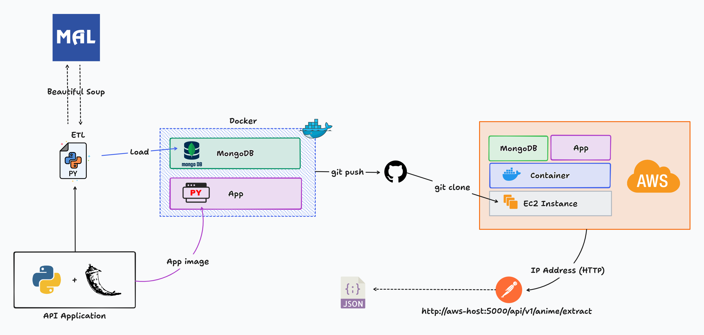
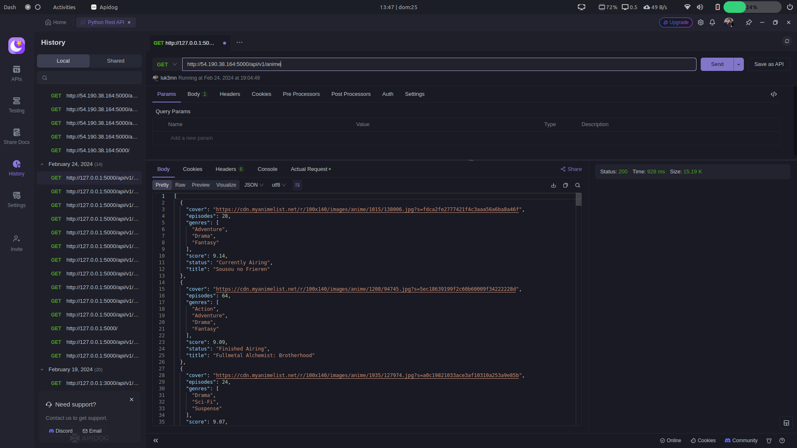
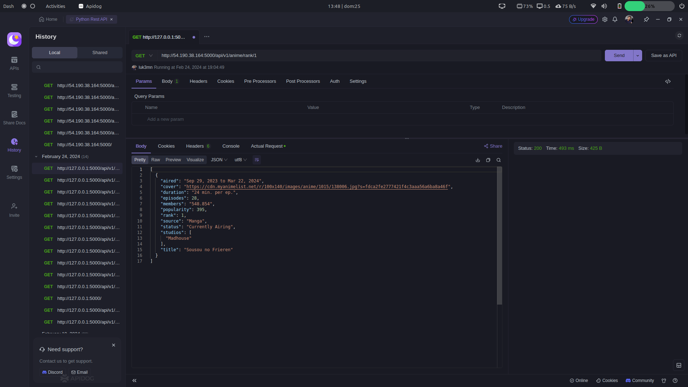
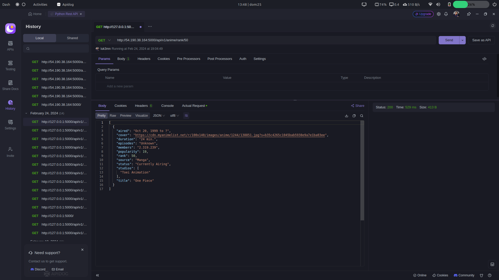
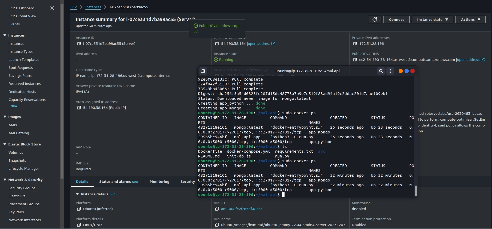

<a name="mal-api"></a>

[![Contributors][contributors-shield]][contributors-url]
[![Forks][forks-shield]][forks-url]
[![Stargazers][stars-shield]][stars-url]
[![Issues][issues-shield]][issues-url]
[![MIT License][license-shield]][license-url]
[![LinkedIn][linkedin-shield]][linkedin-url]


<!-- PROJECT LOGO -->
<br />
<div align="center">
  <a href="https://github.com/luk3mn/mal-api">
    
  </a>

  <h3 align="center">MAL - API</h3>

  <p align="center">
    Back-end web application using Python and Flask to build a Rest API by extracting data from <a href='https://myanimelist.net/'>My Anime List</a> through web scraping.
    <br />
    <a href="https://github.com/luk3mn/mal-api/README.md"><strong>Explore the docs »</strong></a>
    <br />
    <br />
  </p>
</div>


<!-- TABLE OF CONTENTS -->
<details>
  <summary>Table of Contents</summary>
  <ol>
    <li>
      <a href="#about-the-project">About The Project</a>
      <ul>
        <li><a href="#built-with">Built With</a></li>
      </ul>
    </li>
    <li>
      <a href="#getting-started">Getting Started</a>
      <ul>
        <li><a href="#prerequisites">Prerequisites</a></li>
        <li><a href="#installation">Installation</a></li>
      </ul>
    </li>
    <li><a href="#usage">Usage</a></li>
    <li><a href="#roadmap">Roadmap</a></li>
    <li><a href="#license">License</a></li>
    <li><a href="#contact">Contact</a></li>
    <li><a href="#acknowledgments">Acknowledgments</a></li>
  </ol>
</details>


<!-- ABOUT THE PROJECT -->
## About The Project



<p align="justify">

  In this project, it was necessary to split it into some parts, such as: 
  - **ETL Pipeline:** Extraction using web scraping strategy, transformation of these data and load in the MongoDB database;
  - **Database configuration:** configuration to assist a connection from Flask application to MongoDB collections;
  - **Build Rest API:** It was created some endpoints API to consume these data from the database;
  - **Deployment on AWS:** It's time to make this project available on the internet, and to fulfill this step it's necessary to use containers docker to work with the application and database separately and an easy way to apply changes whenever we want;
</p> 

### Extract and Validation
All the data used in this project belongs to <a href='https://myanimelist.net/'>My Anime List</a> extracted by web scraping method and it was possible by using the library **"Beautiful Soup"**. During this process, it was able to go through several contents and organize them to store in a dictionary to facilitate some validation process before loading in the MongoDB database.


### Load on MongoDB
To be able to create a connection between Flask and MongoDB, it was necessary to use the library **"pymongo"** which facilitated a bunch of features that included connection resources and collection manipulation.


### REST API
The API endpoints were built using the Flask framework from Python and on top of that, it was needed to create a DTO class to limit the quantity of information during endpoint requests.

---
#### Extract new data from the data source

```http
  GET /api/v1/anime/extract
```

| Parameter | Type     | Description                |
| :-------- | :------- | :------------------------- |
| `None`    |  `None`  | **Required**. to extract and load new data |

---
#### List all anime

```http
  GET /api/v1/anime
```

| Parameter     | Type     |     Description      |
| :-------------| :------- | :------------------- |
| `None`        | `None`   | to list all anime    |

---
#### Get by anime name
```http
  GET /api/v1/anime/name/${anime_name}
```

| Parameter     | Type     |     Description      |
| :-------------| :------- | :------------------- |
| `anime_name`  | `string`    | to get anime by name |

---
#### Get anime by genre
```http
  GET /api/v1/anime/genre/${genre_name}
```

| Parameter     | Type     |     Description      |
| :-------------| :------- | :------------------- |
| `genre_name`  | `string`    | to get anime by genre |

---
#### Get anime by rank
```http
  GET /api/v1/anime/rank/${anime_rank}
```

| Parameter     | Type     |     Description      |
| :-------------| :------- | :------------------- |
| `anime_rank`  | `integer`    | to get anime by rank |

---
#### Get anime by score
```http
  GET /api/v1/anime/score/${anime_score}
```

| Parameter      | Type     |     Description      |
| :--------------| :------- | :------------------- |
| `anime_score`  | `integer`    | to get anime by score |


<p align="right">(<a href="#mal-api">back to top</a>)</p>


### Built With

* [![Python][Python]][Python-url]
* [![Flask][Flask]][Flask-url]
* [![Mongo][Mongo]][Mongo-url]
* [![Javascript][Javascript]][Javascript-url]

<p align="right">(<a href="#mal-api">back to top</a>)</p>


<!-- GETTING STARTED -->
## Getting Started

Here are some important topics about this project and how to replay it.

### Prerequisites

* virtualenv
  ```sh
  python3 -m venv .venv
  ```

* Environment Variables
  
  To run this project, you will need to add the following environment variables to your **.env** file

  `HOST`

  `PORT`

  `DB_NAME`

### Installation

_Before starting this application in your local environment, it'll be necessary to proceed with some tasks to reproduce this project._

1. Clone the repo
   ```sh
   git clone https://github.com/luk3mn/mal-api.git
   ```
2. Install packages
   ```sh
   pip freeze -r requirements.txt
   ```

<p align="right">(<a href="#mal-api">back to top</a>)</p>


<!-- USAGE EXAMPLES -->
## Usage / Examples
<p style="text-align: justify"> This project can be deployed on AWS simply by using an EC2 instance and releasing port 5000 to the Anywhere IP address. Once the instance is working, just follow the <span style="font-weight: 700; font-style: italic">Deplymet</span> steps next and use an IP address allocated to the EC2 instance on port 5000 on Postman, APIDOG or whatever application that allows the testing of web APIs. </p>

### Screenshots

- GET /api/v1/anime



- GET /api/v1/anime/rank/1



- GET /api/v1/anime/rank/50



- Running on AWS EC2 using Docker containers


## Deployment

To deploy this project run

* [Install Docker Engine](https://docs.docker.com/engine/install/)

* docker-compose
  ```sh
  sudo apt install docker-compose
  ```

* Running the application and MongoDB using containers
    ```bash
    sudo docker-compose up -d
    ```

<!-- ROADMAP -->
## Roadmap

> Processing
- [x] Extract: get data from the source using web scraping
- [x] Transform: to valid some information before storing it in the database
- [x] Load: store data in MongoDB database

> MongoDB
- [x] Database configuration
- [x] Working on repository class

> API Rest
- [x] GET /api/v1/anime/extract
- [x] GET /api/v1/anime
- [x] GET /api/v1/anime/name/{anime_name}
- [x] GET /api/v1/anime/genre/{genre_name}
- [x] GET /api/v1/anime/rank/{anime_rank}
- [x] GET /api/v1/anime/score/{anime_score}

> Docker
- [x] Run Python application by docker
- [x] Run MongoDB database by docker

> Deploy
- [x] AWS

<p align="right">(<a href="#mal-api">back to top</a>)</p>

## Lessons Learned

<p style="text-align: justify"> 
This project was an excellent learning object for me. I was able to deep into REST API architecture using Python and Flask, ways to use Docker to deploy an application in a container by using docker-compose and Dockerfile, and finally to get running the application on the cloud using AWS EC2 Instances.</p>

<!-- LICENSE -->
## License

Distributed under the MIT License. See `LICENSE.txt` for more information.

<p align="right">(<a href="#mal-api">back to top</a>)</p>


<!-- CONTACT -->
## Authors

- username: [@luk3mn](https://www.github.com/luk3mn)

## Feedback

If you have any feedback, please reach out to us at lucasnunes2030@gmail.com

> Project Link: [https://github.com/luk3mn/mal-api](https://github.com/luk3mn/mal-api)

<p align="right">(<a href="#mal-api">back to top</a>)</p>


<!-- ACKNOWLEDGMENTS -->
## Acknowledgments

I think it would be interesting to place here some references and other resources that were useful and helped me to work on this project. I hope it can help you as well!
* [Web Scraping With Python – Step-By-Step Guide](https://brightdata.com/blog/how-tos/web-scraping-with-python)
* [Beautiful Soup: Build a Web Scraper With Python](https://realpython.com/beautiful-soup-web-scraper-python/)
* [StackOverflow](https://stackoverflow.com/questions/25589113/how-to-select-a-single-field-for-all-documents-in-a-mongodb-collection)
* [w3schools: Python MongoDB Find](https://www.w3schools.com/python/python_mongodb_find.asp)
* [How to Use *args and **kwargs in Python](https://www.freecodecamp.org/news/args-and-kwargs-in-python/)
* [Design Patterns for REST-APIs](https://medium.com/@patricksavalle/rest-api-design-as-a-craft-not-an-art-a3fd97ed3ef4)
* [How to Dockerize a Flask Application](https://www.freecodecamp.org/news/how-to-dockerize-a-flask-app/)
* [Python MongoDB tutorial using PyMongo and Docker](https://www.youtube.com/watch?v=xb3v2kTJM28&ab_channel=CoderVlogger)
* [Creating Dockerized Flask + MongoDB Application](https://medium.com/analytics-vidhya/creating-dockerized-flask-mongodb-application-20ccde391a)
* [How To Set Up Flask with MongoDB and Docker](https://www.digitalocean.com/community/tutorials/how-to-set-up-flask-with-mongodb-and-docker)
* [Create an API using Flask, MongoDB and Docker](https://blog.tkav.dev/create-an-api-using-flask-mongodb-and-docker)
* [MongoDB docker image documentation](https://hub.docker.com/_/mongo/)
* [Quick MongoDB Docker Setup](https://cj-hewett.medium.com/quick-mongodb-docker-setup-d1959c8fc8f2)

<p align="right">(<a href="#mal-api">back to top</a>)</p>


<!-- MARKDOWN LINKS & IMAGES -->
<!-- https://www.markdownguide.org/basic-syntax/#reference-style-links -->
[contributors-shield]: https://img.shields.io/github/contributors/luk3mn/mal-api.svg?style=for-the-badge
[contributors-url]: https://github.com/luk3mn/mal-api/graphs/contributors
[issues-shield]: https://img.shields.io/github/issues/luk3mn/mal-api.svg?style=for-the-badge
[issues-url]: https://github.com/luk3mn/mal-api/issues
[forks-shield]: https://img.shields.io/github/forks/luk3mn/mal-api.svg?style=for-the-badge
[forks-url]: https://github.com/luk3mn/mal-api/network/members
[stars-shield]: https://img.shields.io/github/stars/luk3mn/mal-api.svg?style=for-the-badge
[stars-url]: https://github.com/luk3mn/mal-api/stargazers
[license-shield]: https://img.shields.io/github/license/othneildrew/Best-README-Template.svg?style=for-the-badge
[license-url]: https://github.com/luk3mn/mal-api/blob/master/LICENSE
[linkedin-shield]: https://img.shields.io/badge/-LinkedIn-black.svg?style=for-the-badge&logo=linkedin&colorB=555
[linkedin-url]: https://www.linkedin.com/in/lucasmaues/
[general-code-screenshot]: assets/general-project.png

<!-- Stack Shields -->
[Python]: https://img.shields.io/badge/Python-3776AB?style=for-the-badge&logo=python&logoColor=ffffff
[Python-url]: https://www.python.org/
[Flask]: https://img.shields.io/badge/Flask-000000?style=for-the-badge&logo=flask&logoColor=ffffff
[Flask-url]: https://flask.palletsprojects.com/en/3.0.x/
[Mongo]: https://img.shields.io/badge/Mongodb-green?style=for-the-badge&logo=mongodb&logoColor=ffffff
[Mongo-url]: https://www.mongodb.com/docs/
[Javascript]: https://img.shields.io/badge/JavaScript-F7DF1E?style=for-the-badge&logo=javascript&logoColor=black
[Javascript-url]: https://developer.mozilla.org/pt-BR/docs/Web/JavaScript